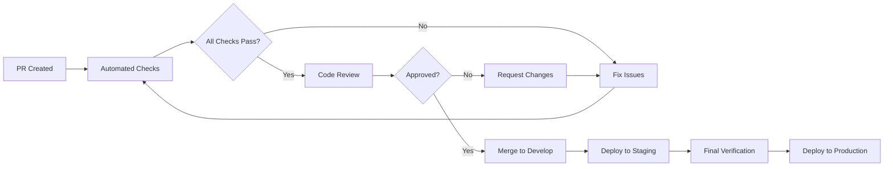
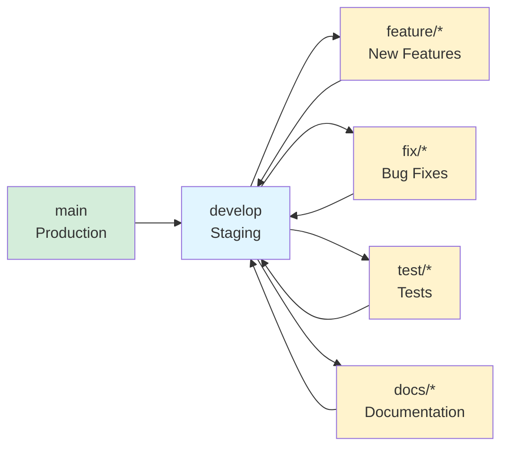

# Contributing Guide

## Welcome Contributors!

Thank you for your interest in contributing to the Webhooks Inventory Management System! This guide will help you get started.

---

## Table of Contents

- [Code of Conduct](#code-of-conduct)
- [Getting Started](#getting-started)
- [How to Contribute](#how-to-contribute)
- [Pull Request Guidelines](#pull-request-guidelines)
- [Coding Standards](#coding-standards)
- [Issue Reporting](#issue-reporting)
- [Community](#community)

---

## Code of Conduct

### Our Pledge

We pledge to make participation in our project a harassment-free experience for everyone. We welcome contributors of all backgrounds and experience levels.

### Our Standards

**Examples of behavior that contributes to a positive environment:**

- Using welcoming and inclusive language
- Being respectful of differing viewpoints
- Gracefully accepting constructive criticism
- Focusing on what is best for the community

**Examples of unacceptable behavior:**

- The use of sexualized language or imagery
- Trolling, insulting/derogatory comments
- Public or private harassment
- Publishing others' private information without permission

---

## Getting Started

### 1. Fork the Repository

```bash
# Click "Fork" on GitHub, then clone your fork
git clone https://github.com/YOUR_USERNAME/03-Webhooks-Inventory-Management-System.git
cd 03-Webhooks-Inventory-Management-System
```

### 2. Set Up Development Environment

```bash
# Create virtual environment
python -m venv venv
venv\Scripts\activate  # Windows
source venv/bin/activate  # Linux/Mac

# Install dependencies
pip install -r requirements.txt

# Create .env file
cp .env.example .env
# Edit .env with your configuration
```

### 3. Create a Branch

```bash
# Ensure you're on develop branch
git checkout develop
git pull origin develop

# Create feature branch
git checkout -b feature/your-feature-name
```

---

## How to Contribute

### Types of Contributions

#### 1. Bug Fixes

Look for issues labeled `bug` or `good first issue`.

```bash
# Example: Fix CallMeBot typos
git checkout -b fix/callmebot-typos
# Make fixes
git commit -m "fix(callmebot): correct variable name typos"
```

#### 2. New Features

Propose features by creating an issue first.

```bash
# Example: Add authentication
git checkout -b feature/add-api-authentication
# Implement feature
git commit -m "feat(auth): add API key authentication"
```

#### 3. Documentation

Improve existing docs or add new documentation.

```bash
# Example: Add API examples
git checkout -b docs/add-api-examples
git commit -m "docs(api): add request/response examples"
```

#### 4. Tests

Add tests to improve coverage.

```bash
# Example: Add model tests
git checkout -b test/add-model-tests
git commit -m "test(models): add Webhook model tests"
```

#### 5. Performance Improvements

Optimize existing code.

```bash
# Example: Optimize database queries
git checkout -b perf/optimize-db-queries
git commit -m "perf(db): optimize webhook query performance"
```

---

## Making Changes

### 1. Make Your Changes

Follow the [Coding Standards](#coding-standards) and [Development Guide](development.md).

### 2. Test Your Changes

```bash
# Run tests
python manage.py test

# Run linting
flake8 .
black --check .
isort --check-only .
```

### 3. Commit Your Changes

```bash
# Stage changes
git add .

# Commit with conventional commit message
git commit -m "type(scope): description"
```

### 4. Push to Your Fork

```bash
git push origin feature/your-feature-name
```

### 5. Create Pull Request

1. Go to your fork on GitHub
2. Click "Compare & pull request"
3. Fill in the PR template
4. Request review from maintainers

---

## Pull Request Guidelines

### PR Title Format

```
type(scope): brief description
```

**Examples:**
```
feat(auth): add API key authentication
fix(callmebot): correct variable name typos
docs(api): update endpoint documentation
test(views): add webhook view tests
refactor(models): simplify webhook model
```

### PR Description Template

```markdown
## Description
Brief description of changes

## Type of Change
- [ ] Bug fix (non-breaking change that fixes an issue)
- [ ] New feature (non-breaking change that adds functionality)
- [ ] Breaking change (fix or feature that would cause existing functionality to change)
- [ ] Documentation update

## Related Issue
Closes #123

## Testing
- [ ] Tests pass locally
- [ ] New tests added for new functionality
- [ ] Manual testing completed

## Checklist
- [ ] Code follows project style guidelines
- [ ] Self-review completed
- [ ] Documentation updated
- [ ] No new warnings
- [ ] Tests added/updated
```

### Review Process



### Merge Requirements

- [ ] All automated checks passing
- [ ] At least 1 approval from maintainer
- [ ] No unresolved comments
- [ ] Tests added/updated as needed
- [ ] Documentation updated

---

## Coding Standards

### Python Style

Follow PEP 8 and project [Guidelines](guidelines.md).

```python
# ✅ Good
def calculate_profit(selling_price, cost_price, quantity):
    """Calculate profit from sale."""
    return (selling_price - cost_price) * quantity

# ❌ Bad
def calcProfit(sp,cp,q):  # Bad naming, no docstring
    return (sp-cp)*q
```

### Code Organization

```python
# Import order
import os  # Standard library
from django.db import models  # Third-party
from .models import Webhook  # Local application
```

### Documentation

```python
class WebhookOrderView(APIView):
    """View to handle incoming order webhook events."""
    
    def post(self, request):
        """
        Process incoming webhook order event.
        
        Args:
            request: HTTP POST request with event data
            
        Returns:
            Response with event data and calculated values
        """
        # Implementation
```

---

## Community

- Open discussions and questions through GitHub Issues.
- Use pull request comments for code-specific feedback.
- Keep communication respectful, objective, and collaborative.

---

## Issue Reporting

### Before Creating an Issue

1. Search existing issues (open and closed)
2. Check if issue is resolved in develop branch
3. Gather relevant information

### Issue Template

```markdown
## Bug Report

### Description
Clear description of the bug

### To Reproduce
Steps to reproduce:
1. Go to '...'
2. Click on '...'
3. See error

### Expected Behavior
What should happen

### Screenshots
If applicable

### Environment
- OS: [e.g., Windows 10]
- Python: [e.g., 3.10]
- Django: [e.g., 5.2.5]

### Additional Context
Any other relevant information
```

### Feature Request Template

```markdown
## Feature Request

### Problem
What problem does this solve?

### Proposed Solution
How should it work?

### Alternatives Considered
Other solutions you've thought about

### Additional Context
Any other relevant information
```

---

## Development Workflow

### Branch Strategy



### Commit Message Format

```
type(scope): subject

body (optional)

footer (optional)
```

**Types:**
- `feat`: New feature
- `fix`: Bug fix
- `docs`: Documentation
- `style`: Formatting
- `refactor`: Code restructuring
- `test`: Tests
- `chore`: Maintenance

**Examples:**
```
feat(auth): add API key authentication middleware

Implemented custom API key authentication for webhook endpoints.
Keys are validated against WEBHOOK_API_KEY environment variable.

Closes #45

---

fix(callmebot): correct response variable typo

Changed 'respose' to 'response' in CallMeBot service.
Fixed 'urf' to 'url' in requests.get call.

---

docs(api): add authentication examples to API documentation

Added cURL, Python, and JavaScript examples for authenticated requests.
Included error response examples.
```

---

## Testing Requirements

### Before Submitting PR

```bash
# Run all tests
python manage.py test

# Check code style
flake8 .

# Format code
black .
isort .

# Check for common issues
python manage.py check
```

### Test Coverage

Aim for minimum 85% coverage:

```bash
# Install coverage
pip install coverage

# Run with coverage
coverage run manage.py test
coverage report

# Target coverage
# Models: 90%
# Views: 85%
# Services: 95%
```

---

## Documentation

### When to Update Documentation

- Adding new features
- Changing API behavior
- Modifying configuration
- Fixing bugs that affect usage

### Documentation Standards

- Use clear, concise language
- Include code examples
- Add diagrams where helpful
- Keep in sync with code changes

---

## Recognition

Contributors will be recognized in:

- [README.md](https://github.com/GabrielDLobo/03-Webhooks-Inventory-Management-System/blob/master/README.md) - Contributors section
- [release-notes.md](release-notes.md) - Version changelog
- Project documentation - Author attribution

---

## Questions?

### Getting Help

1. Check existing [documentation](index.md)
2. Search [issues](https://github.com/your-repo/issues)
3. Ask in discussions (if enabled)
4. Contact maintainers

### Contact Maintainers

- **Lead Developer**: [Contact Info]
- **Project Manager**: [Contact Info]

---

## License

By contributing, you agree that your contributions will follow the repository licensing policy.

---

## Thank You!

Every contribution, no matter how small, helps make this project better. We appreciate your time and effort!

---

## Next Steps

- Review [Development Guide](development.md) for development practices
- Check [Testing Guide](testing.md) for testing requirements
- Read [API Endpoints](api-endpoints.md) to understand the system
- Look at [Good First Issues](https://github.com/your-repo/issues?q=is%3Aissue+is%3Aopen+label%3A%22good+first+issue%22)
