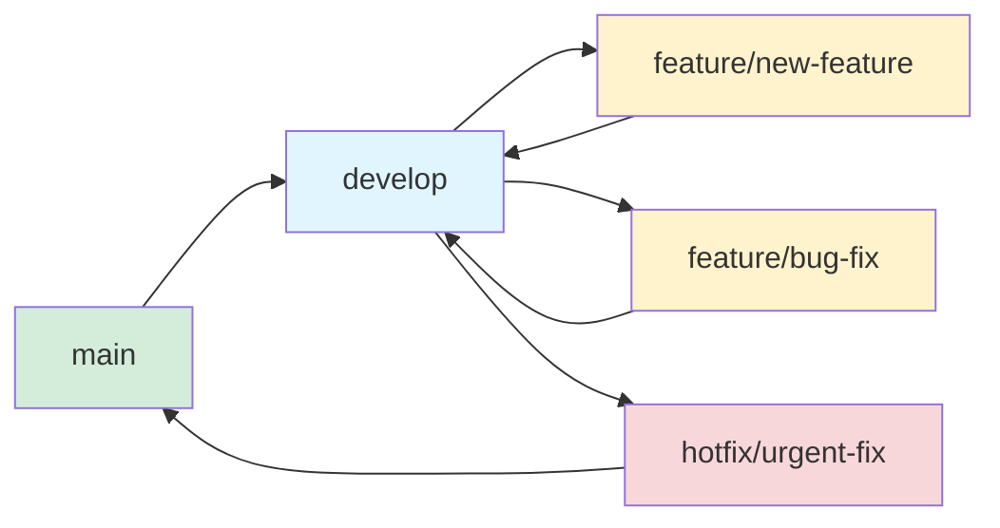

# Development Guide

## Development Environment Setup

### Prerequisites

- Python 3.10 or higher
- pip (Python package manager)
- Git
- Code editor (VS Code, PyCharm, etc.)
- SQLite Browser (optional, for database inspection)

### Initial Setup

```bash
# Clone the repository
git clone <repository-url>
cd 03-Webhooks-Inventory-Management-System

# Create virtual environment
python -m venv venv

# Activate virtual environment
# Windows
venv\Scripts\activate
# Linux/Mac
source venv/bin/activate

# Install dependencies
pip install -r requirements.txt

# Create .env file from example
cp .env.example .env

# Run migrations
python manage.py migrate

# Create superuser for admin access
python manage.py createsuperuser
```

### Environment Configuration

Create a `.env` file in the project root:

```env
# Django Settings
DEBUG=True
SECRET_KEY=your-development-secret-key
ALLOWED_HOSTS=localhost,127.0.0.1

# CallMeBot Configuration
CALLMEBOT_API_URL=https://api.callmebot.com/whatsapp.php
CALLMEBOT_PHONE_NUMBER=+1234567890
CALLMEBOT_API_KEY=your-api-key

# Email Configuration (Development)
EMAIL_HOST=smtp.gmail.com
EMAIL_PORT=587
EMAIL_HOST_USER=your-email@gmail.com
EMAIL_HOST_PASSWORD=your-app-password
EMAIL_ADMIN_RECEIVER=admin@example.com
EMAIL_USE_TLS=True

# Webhook Security (Development)
WEBHOOK_API_KEY=dev-api-key-12345
```

---

## Development Workflow

### Branch Strategy



### Branch Naming Conventions

| Branch Type | Pattern | Example |
|-------------|---------|---------|
| Feature | `feature/<description>` | `feature/api-authentication` |
| Bug Fix | `fix/<description>` | `fix/callmebot-typos` |
| Hotfix | `hotfix/<description>` | `hotfix/security-patch` |
| Documentation | `docs/<description>` | `docs/api-documentation` |
| Refactor | `refactor/<description>` | `refactor/views-structure` |

### Development Steps

1. **Create Feature Branch**
   ```bash
   git checkout develop
   git pull origin develop
   git checkout -b feature/your-feature-name
   ```

2. **Make Changes**
   - Write code following project guidelines
   - Write tests for new functionality
   - Update documentation as needed

3. **Commit Changes**
   ```bash
   git add .
   git commit -m "feat: add your feature description"
   ```

4. **Push and Create PR**
   ```bash
   git push origin feature/your-feature-name
   ```

---

## Code Organization

### File Structure

```
webhooks/
├── models.py      # Database models
├── views.py       # Request handlers
├── serializers.py # Data validation (to be created)
├── admin.py       # Admin configuration
├── messages.py    # Message templates
├── tests.py       # Unit tests
└── templates/     # HTML templates
```

### Import Order

```python
# 1. Standard library imports
import json
import logging
from datetime import datetime

# 2. Third-party imports
from django.db import models
from rest_framework.views import APIView
import requests

# 3. Local application imports
from .models import Webhook
from .services.callmebot import CallMeBot
```

---

## Common Development Tasks

### Creating a New Model

```python
# models.py
from django.db import models
import uuid

class NewModel(models.Model):
    """Description of the model."""
    
    id = models.UUIDField(
        primary_key=True,
        default=uuid.uuid4,
        editable=False
    )
    name = models.CharField(max_length=100)
    created_at = models.DateTimeField(auto_now_add=True)
    
    class Meta:
        ordering = ['-created_at']
    
    def __str__(self):
        return self.name
```

**Create Migration:**
```bash
python manage.py makemigrations
python manage.py migrate
```

**Register in Admin:**
```python
# admin.py
@admin.register(NewModel)
class NewModelAdmin(admin.ModelAdmin):
    list_display = ('name', 'created_at')
```

### Creating a New View

```python
# views.py
from rest_framework.views import APIView
from rest_framework.response import Response
from rest_framework import status
from .serializers import NewSerializer

class NewView(APIView):
    """View for handling new functionality."""
    
    def get(self, request):
        """Handle GET requests."""
        return Response({'message': 'GET request successful'})
    
    def post(self, request):
        """Handle POST requests."""
        serializer = NewSerializer(data=request.data)
        
        if serializer.is_valid():
            # Process data
            return Response(
                {'message': 'Success'},
                status=status.HTTP_201_CREATED
            )
        
        return Response(
            serializer.errors,
            status=status.HTTP_400_BAD_REQUEST
        )
```

**Add URL:**
```python
# urls.py
from django.urls import path
from .views import NewView

urlpatterns = [
    path('api/V1/new-endpoint/', NewView.as_view(), name='new-endpoint'),
]
```

### Creating a Serializer

```python
# serializers.py
from rest_framework import serializers

class NewSerializer(serializers.Serializer):
    """Serializer for new functionality."""
    
    name = serializers.CharField(max_length=100)
    email = serializers.EmailField()
    value = serializers.DecimalField(max_digits=10, decimal_places=2)
    
    def validate_value(self, value):
        """Validate value is positive."""
        if value <= 0:
            raise serializers.ValidationError(
                "Value must be positive"
            )
        return value
```

### Sending Notifications

```python
# Using CallMeBot service
from services.callmebot import CallMeBot

def send_whatsapp_notification(message):
    bot = CallMeBot()
    response = bot.send_message(message)
    return response

# Using Email
from django.core.mail import send_mail
from django.template.loader import render_to_string

def send_email_notification(context):
    html_message = render_to_string('outflow.html', context)
    
    send_mail(
        subject='New Outflow Created',
        message='',
        from_email='noreply@example.com',
        recipient_list=['admin@example.com'],
        html_message=html_message,
        fail_silently=False,
    )
```

---

## Debugging

### Django Debug Toolbar

**Installation:**
```bash
pip install django-debug-toolbar
```

**Configuration:**
```python
# settings.py
INSTALLED_APPS += ['debug_toolbar']
MIDDLEWARE += ['debug_toolbar.middleware.DebugToolbarMiddleware']

INTERNAL_IPS = ['127.0.0.1']
```

### Logging

**Configuration:**
```python
# settings.py
LOGGING = {
    'version': 1,
    'disable_existing_loggers': False,
    handlers: {
        'console': {
            'class': 'logging.StreamHandler',
        },
    },
    root: {
        'handlers': ['console'],
        'level': 'DEBUG',
    },
}
```

**Usage:**
```python
import logging

logger = logging.getLogger(__name__)

def my_function():
    logger.debug('Debug message')
    logger.info('Info message')
    logger.warning('Warning message')
    logger.error('Error message')
```

### Django Shell

```bash
# Open interactive shell
python manage.py shell

# Query database
from webhooks.models import Webhook
Webhook.objects.all()

# Test services
from services.callmebot import CallMeBot
bot = CallMeBot()
bot.send_message("Test message")
```

---

## Database Management

### Migrations

```bash
# Create migrations after model changes
python manage.py makemigrations

# Show SQL that will be executed
python manage.py sqlmigrate webhooks 0001

# Apply migrations
python manage.py migrate

# List migrations
python manage.py showmigrations
```

### Database Commands

```bash
# Open database shell
python manage.py dbshell

# Export data
python manage.py dumpdata webhooks > webhooks_data.json

# Import data
python manage.py loaddata webhooks_data.json
```

---

## Known Issues & Fixes

### 1. CallMeBot Service Typos

**Current Code (Buggy):**
```python
def send_message(self, message):
    respose = requests.get(  # ❌ Typo
        urf=f'{self.__base_url}?...',  # ❌ Typo
    )
    return response.text  # ❌ Undefined variable
```

**Fixed Code:**
```python
def send_message(self, message):
    response = requests.get(
        url=f'{self.__base_url}?phone={self.__phone_number}&text={message}&apikey={self.__api_key}'
    )
    return response.text
```

### 2. Email SSL/TLS Configuration

**Issue:** Email not sending due to missing SSL/TLS setting.

**Fix in settings.py:**
```python
# Add after EMAIL_PORT configuration
EMAIL_USE_TLS = True  # For port 587
# OR
EMAIL_USE_SSL = True  # For port 465
```

### 3. Missing Serializers

**Issue:** No data validation on webhook endpoint.

**Solution:** Create `serializers.py` with proper validation (see [Creating a Serializer](#creating-a-serializer)).

---

## Performance Optimization

### Database Query Optimization

```python
# ❌ Bad: N+1 query problem
webhooks = Webhook.objects.all()
for webhook in webhooks:
    print(webhook.event_type)

# ✅ Good: Single query
webhooks = Webhook.objects.values_list('event_type', flat=True)
```

### Caching

```python
from django.core.cache import cache

# Set cache
cache.set('my_key', 'hello, world!', 30)

# Get cache
value = cache.get('my_key')

# Cache decorator
from django.views.decorators.cache import cache_page

@cache_page(60 * 15)  # Cache for 15 minutes
def my_view(request):
    # ...
```

---

## Code Quality Tools

### Flake8

```bash
pip install flake8
flake8 .
```

**.flake8 configuration:**
```ini
[flake8]
max-line-length = 100
exclude = venv,*/migrations/*,*/__pycache__/*
ignore = E203,W503
```

### Black (Code Formatter)

```bash
pip install black
black .
```

### isort (Import Sorter)

```bash
pip install isort
isort .
```

---

## Environment-Specific Settings

### Development Settings

```python
# settings.py
DEBUG = config('DEBUG', default=True, cast=bool)

if DEBUG:
    # Development settings
    EMAIL_BACKEND = 'django.core.mail.backends.console.EmailBackend'
```

### Production Settings

```python
# settings.py
if not DEBUG:
    # Production settings
    SECURE_SSL_REDIRECT = True
    SESSION_COOKIE_SECURE = True
    CSRF_COOKIE_SECURE = True
    SECURE_HSTS_SECONDS = 31536000
```

---

## API Development Best Practices

### Versioning

All API endpoints should be versioned:
```python
# ✅ Good
path('api/V1/webhooks/order/', ...)

# ❌ Bad
path('api/webhooks/order/', ...)
```

### Response Format

Standardize response format:
```python
# Success response
{
    "data": {...},
    "message": "Operation successful"
}

# Error response
{
    "error": "Error message",
    "details": {...}
}
```

### Status Codes

Use appropriate HTTP status codes:
- `200 OK` - Successful GET, PUT, PATCH
- `201 Created` - Successful POST (resource created)
- `204 No Content` - Successful DELETE
- `400 Bad Request` - Invalid request data
- `401 Unauthorized` - Authentication required
- `403 Forbidden` - Permission denied
- `404 Not Found` - Resource not found
- `429 Too Many Requests` - Rate limit exceeded
- `500 Internal Server Error` - Server error

---

## Next Steps

- Check [API Endpoints](api-endpoints.md) for API documentation
- See [Contributing Guide](contributing.md) for contribution guidelines
