# System Modeling

## Data Models

### Entity Relationship Diagram (ERD)

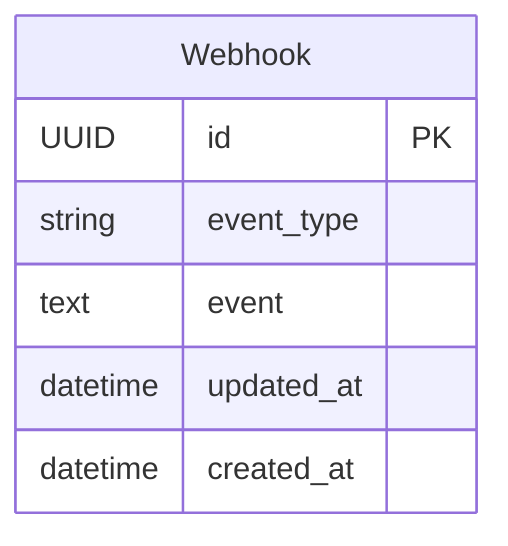

### Webhook Model

| Attribute | Type | Constraints | Description |
|-----------|------|-------------|-------------|
| `id` | UUID | Primary Key, Auto-generated | Unique identifier |
| `event_type` | String(50) | Nullable | Type of webhook event |
| `event` | Text | Nullable | Full JSON payload |
| `updated_at` | DateTime | Auto-now | Last modification timestamp |
| `created_at` | DateTime | Auto-now-add | Creation timestamp |

### Model Relationships

The `Webhook` model is a standalone entity with no foreign key relationships. It serves as an audit log for all incoming webhook events.

---

## System Architecture

### High-Level Architecture

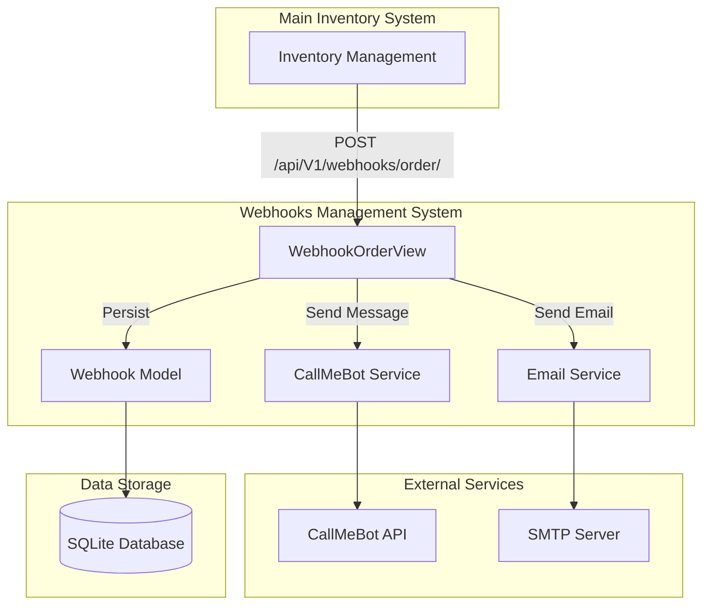

### Component Architecture

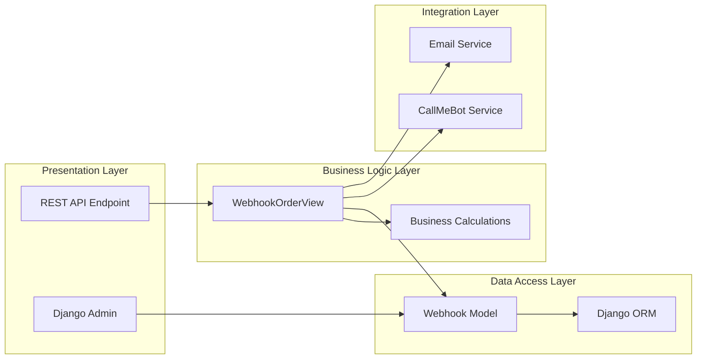

### Deployment Architecture

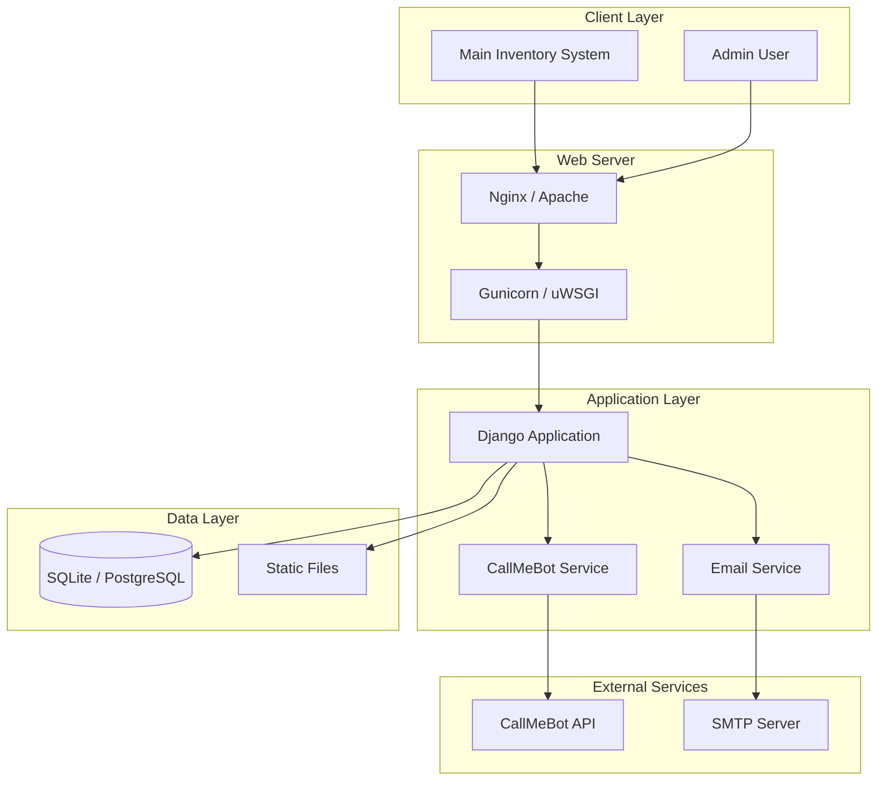

---

## Authentication Flow

### Current Authentication Flow (No Authentication)

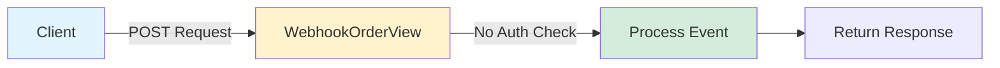

### Recommended Authentication Flow (With API Key)

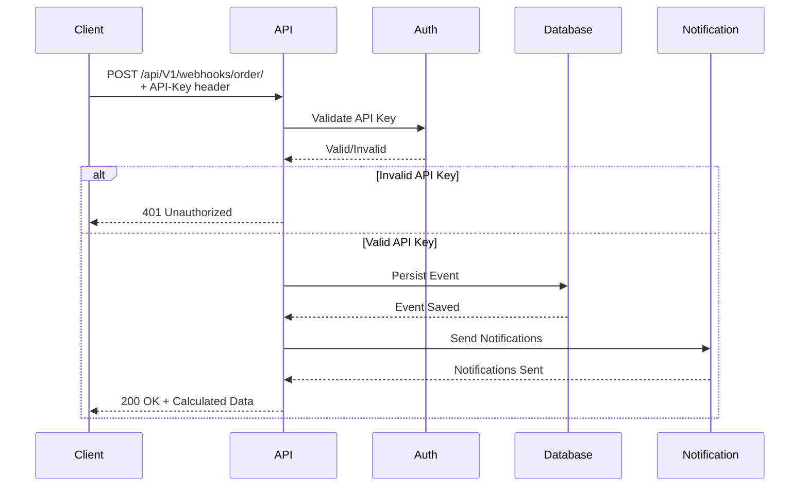

### Admin Authentication Flow

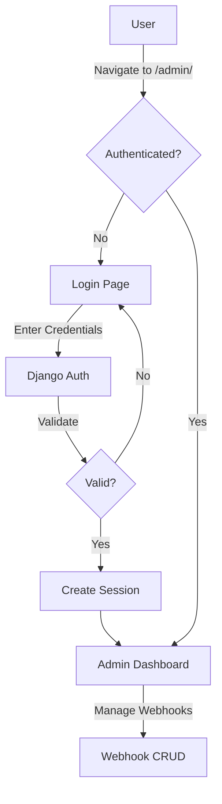

---

## CRUD Operations Flow

### Webhook Event Creation Flow

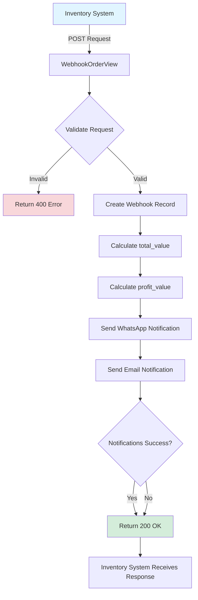

### Complete CRUD Operations

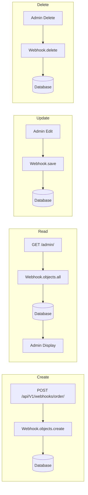

---

## Security Flow

### Current Security Flow (Minimal)

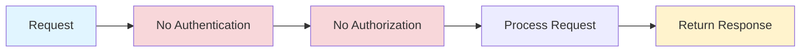

### Recommended Security Flow

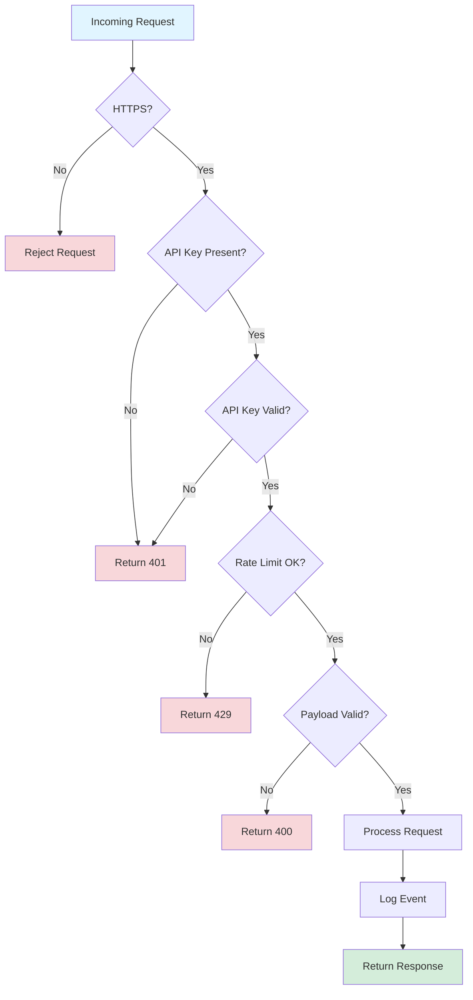

### Data Security Flow

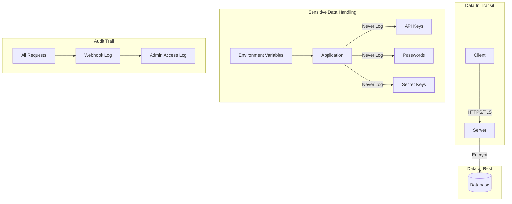

---

## Notification Flow

### WhatsApp Notification Flow

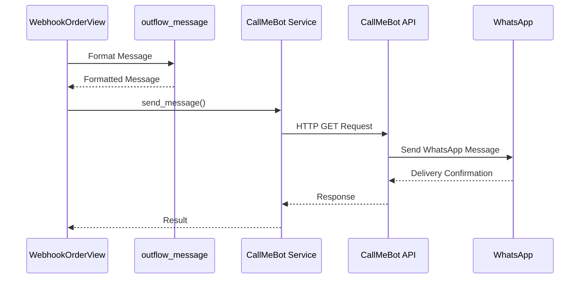

### Email Notification Flow

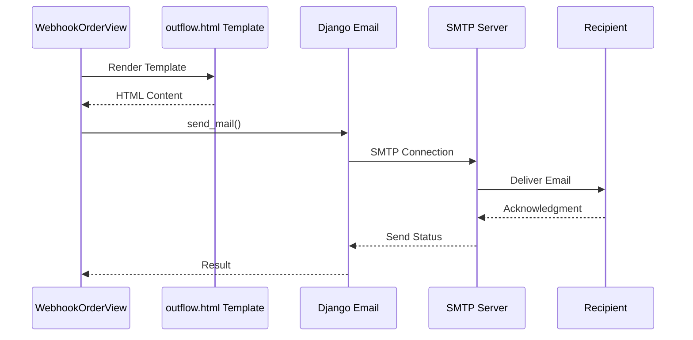

---

## Business Logic Flow

### Value Calculation Flow

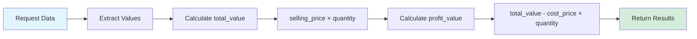

### Complete Request Processing Flow

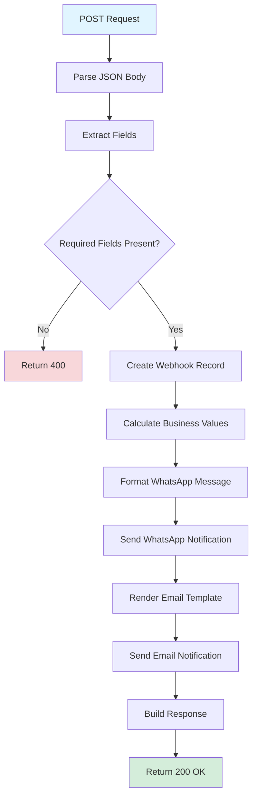

---

## Error Handling Flow

### Exception Flow

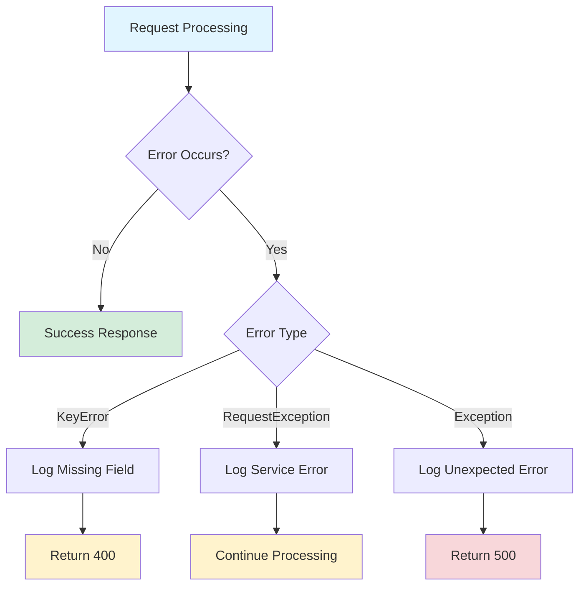

---

## Next Steps

- Review [API Endpoints](api-endpoints.md) for detailed endpoint documentation
- Check [Authentication & Security](authentication-security.md) for security implementation details
- See [Development Guide](development.md) for implementation guidelines
